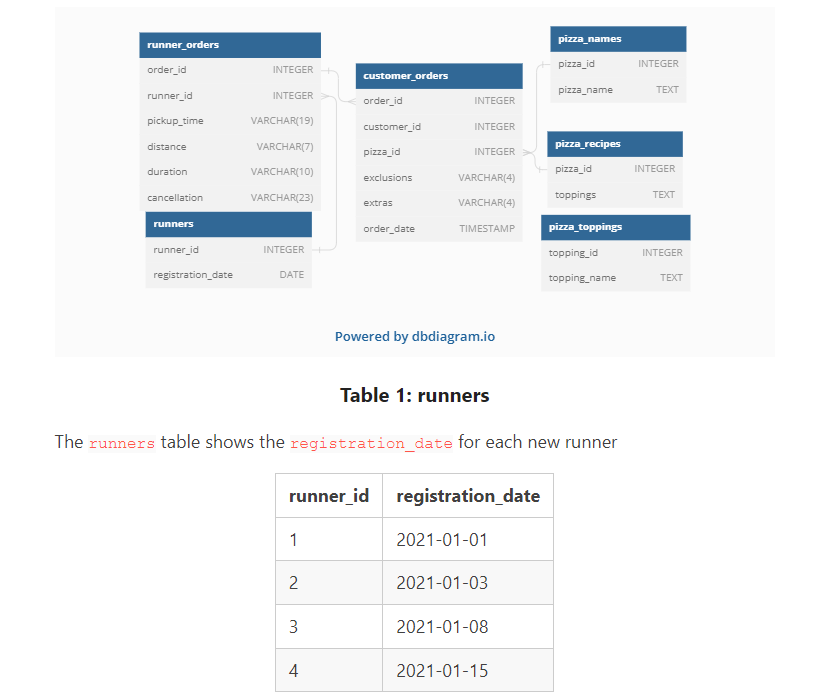
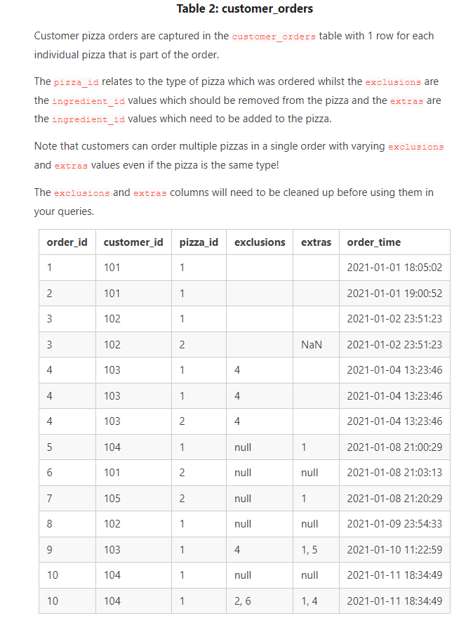
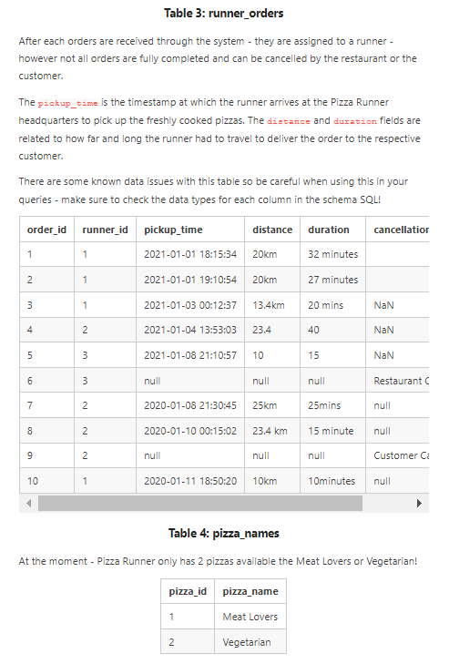
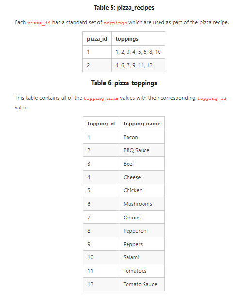

# 
 🍕 Case Study #2 - Danny's Danny-Pizza-Runner 🍕

## 
 Introduction

Were you aware that a staggering 115 million kilograms of pizza are consumed globally on a daily basis? (At least, that's what Wikipedia tells us...)

As Danny was scrolling through his Instagram feed, something truly captured his attention: '80s Retro Styling and the Pizza Revolution!'

Danny was immediately captivated by the idea, recognizing that Pizza alone wouldn't secure the seed funding he needed to expand his innovative Pizza Empire. Thus, he conceived another ingenious plan to complement it — he decided to introduce an Uber-like model. This marked the birth of Pizza Runner!

Danny's first step involved recruiting "runners" to deliver freshly made pizzas from the Pizza Runner Headquarters (also known as Danny's residence). Additionally, he went all in by utilizing his credit card to engage freelance developers in creating a mobile app capable of receiving customer orders.

## 
 Available Data

Because Danny had a few years of experience as a data scientist - he was very aware that data collection was going to be critical for his business’ growth.

He has prepared for us an entity relationship diagram of his database design but requires further assistance to clean his data and apply some basic calculations so he can better direct his runners and optimise Pizza Runner’s operations.

### 
 Entity Relationship Diagram
All datasets exist within the pizza_runner database schema 

## 
 Case Study Questions
### NB: _This analysis was done using MYSQL workbench_

### A. Pizza Metrics
1.  How many pizzas were ordered?
2.  How many unique customer orders were made?
3.  How many successful orders were delivered by each runner?
4.  How many of each type of pizza was delivered?
5.  How many Vegetarian and Meatlovers were ordered by each customer?
6.  What was the maximum number of pizzas delivered in a single order?
7.  For each customer, how many delivered pizzas had at least 1 change and how many had no changes?
8.  How many pizzas were delivered that had both exclusions and extras?
9.  What was the total volume of pizzas ordered for each hour of the day?
10.  What was the volume of orders for each day of the week? [Go to solution](https://github.com/protechanalysis/Danny-Pizza-runner/blob/main/Pizza%20Metrics.sql)

### B. Runner and Customer Experience
1.  How many runners signed up for each 1 week period? (i.e. week starts 2021-01-01)
2.  What was the average time in minutes it took for each runner to arrive at the Pizza Runner HQ to pick up the order?
3.  Is there any relationship between the number of pizzas and how long the order takes to prepare?
4.  What was the average distance travelled for each customer?
5.  What was the difference between the longest and shortest delivery times for all orders?
6.  What was the average speed for each runner for each delivery and do you notice any trend for these values?
7.  What is the successful delivery percentage for each runner? [Go to solution](https://github.com/protechanalysis/Danny-Pizza-runner/blob/main/Runner%20and%20Customer%20Experience.sql)

### C. Ingredient Optimisation 
1.  What are the standard ingredients for each pizza?
2.  What was the most commonly added extra?
3.  What was the most common exclusion?
4.  Generate an order item for each record in the customers_orders table in the format of one of the following:
     - Meat Lovers
     - Meat Lovers - Exclude Beef
     - Meat Lovers - Extra Bacon
     - Meat Lovers - Exclude Cheese, Bacon - Extra Mushroom, Peppers [Go to solution](https://github.com/protechanalysis/Danny-Pizza-runner/blob/main/Ingredient%20Optimisation.sql)

       
### D. Pricing and Ratings
1.  If a Meat Lovers pizza costs $12 and Vegetarian costs $10 and there were no charges for changes - how much money has Pizza Runner made so far if there are no delivery fees?
2.  What if there was an additional $1 charge for any pizza extras?
      -  Add cheese is $1 extra
3.  The Pizza Runner team now wants to add an additional rating system that allows customers to rate their runner, how would you design an additional table for this new dataset
      - generate a schema for this new table and insert your own data for ratings for each successful customer order between 1 to 5.
4.  Using your newly generated table - can you join all of the information together to form a table which has the following information for successful deliveries?
      -  customer_id
      -  order_id
      -  runner_id
      -  rating
      -  order_time
      -  pickup_time
      -  Time between order and pickup
      -  Delivery duration
      -  Average speed
      -  Total number of pizzas
5.  If a Meat Lovers pizza was $12 and Vegetarian $10 fixed prices with no cost for extras and each runner is paid $0.30 per kilometre travelled.
        - how much money does Pizza Runner have left over after these deliveries? [Go to solution](https://github.com/protechanalysis/Danny-Pizza-runner/blob/main/Pricing%20and%20Ratings.sql)

### E. Bonus Questions
If Danny wants to expand his range of pizzas - how would this impact the existing data design? Write an INSERT statement to demonstrate what would happen if a new Supreme pizza with all the toppings was added to the Pizza Runner menu?
[Go to solution](https://github.com/protechanalysis/Danny-Pizza-runner/blob/main/Bonus%20Question.sql)

## 
 Challenges faced

Solving Recipe Ingredient Optimization - Question 1: Creating Standardized Pizza Recipes

To tackle the challenge of optimizing ingredient usage in pizza recipes, I employed a clever solution involving a recursive Common Table Expression (CTE), which I'll refer to as a "loop function." This technique allowed me to efficiently split the recipe table, yielding standardized recipes for each pizza variant.

The recursive CTE proved invaluable as it enabled me to traverse the toppings column for each row systematically, breaking down each topping into its constituent parts. By looping through this process, I effectively transformed the toppings data into an elongated row format, simplifying subsequent operations.

To ensure coherence and comprehension, I then employed the GROUP_CONCAT function to consolidate the toppings' names and corresponding IDs. This facilitated the creation of an initial recipe table that now included standardized recipe names for each pizza.
